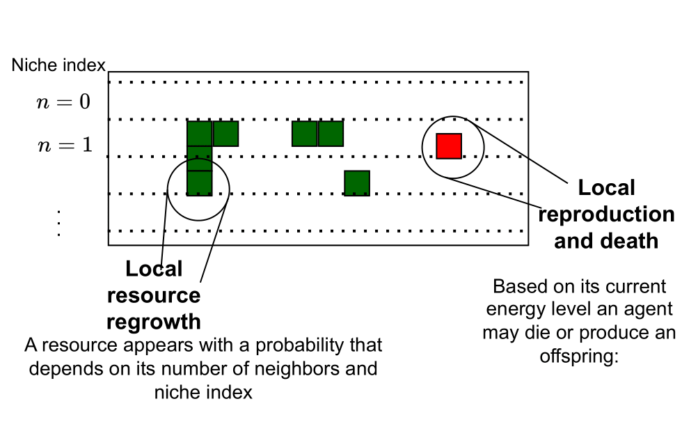
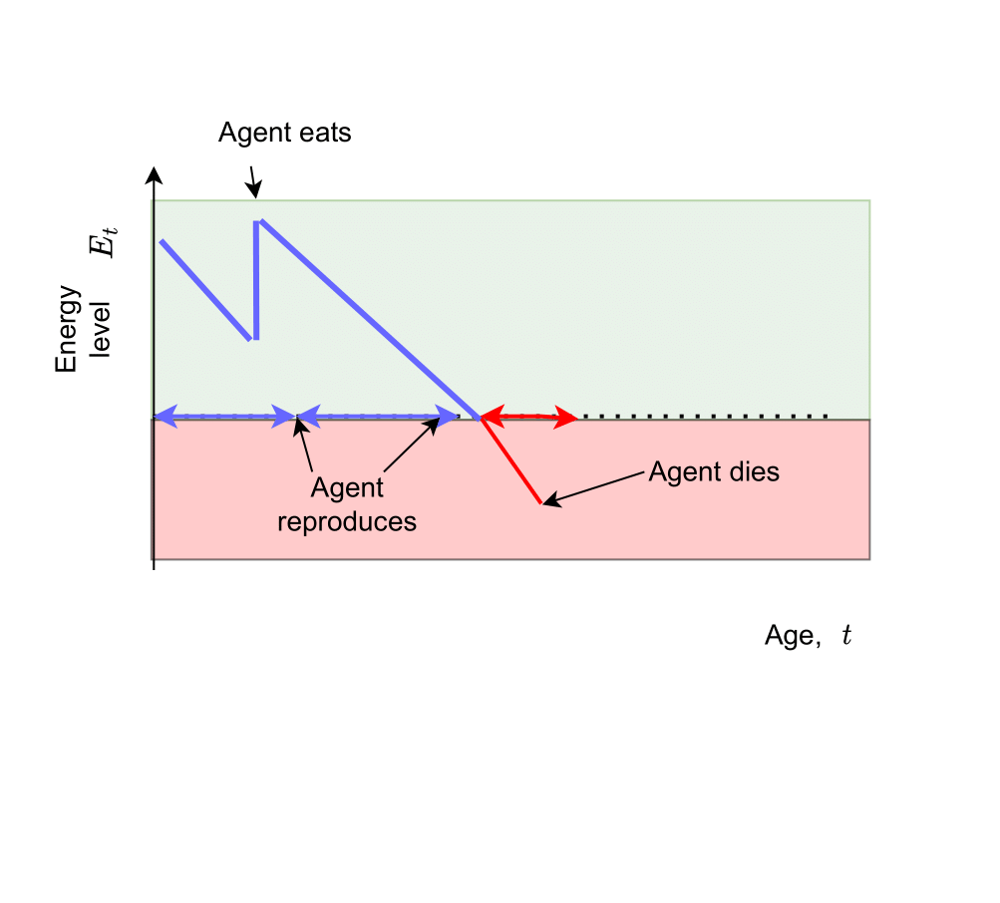

# Eco-evolutionary dynamics of non-episodic neuroevolution in large multi-agent environments

This repo contains code for the paper "Eco-evolutionary dynamics of non-episodic neuroevolution in large multi-agent environments."

The paper is also accompanied by a [website](https://sites.google.com/view/non-episodic-neuroevolution-in) that provides illustrative videos of the simulation. 

## Context

### The environment

In this work we have proposed a grid-world foraging environment. It is implemented in JAX and can support very large population and grid sizes. For example, evolving a population of 1000 agents in a world of 100 K pixels for 1 million time steps takes about 10 minutes on a GPU. 

Here is a schematic of the environment with agents and resources. The latter can grow in any pixel based on a probability that depends on the niche a resource belongs to. In this way, we can get a heterogeneous distribution of resources.

<p align="center">

</p>

For real-time videos of the environment you can visit the [accompanying website](https://sites.google.com/view/non-episodic-neuroevolution-in) 

### Non-episodic neuroevolution

In addition to the environment, we have proposed a neuroevolution method that we call **non-episodic neuroevolution**.   

In classical neuroevolution, there are generations at the end of which the fittest agents in the population are chosen for reproduction.

Our method introduces two modifications:

* **there are no generations**. An agent reproduces when it meets a certain criterion independently of others. So agents can reproduce multiple times within their lifetime and don't die upon reproduction.
* **an agent reproduces when its energy is above a minimum threshold and dies when it is below it.** An agent begins its life with maximum energy, which drops linearly at each time step and receives a step increase when a resource is comsumed. We illustrate the role of the energy level in the following schematic:

<p align="center">

</p>

## How to use

The python packages you will need to have installed to run the code are listed in the requirements.txt file. You can create and activate a conda environment with the command:

```
conda env create -f environment.yml
conda activate ecoevojax
```

You can then run the script file run.py in two ways:

### Evolving populations from scratch

By running the following command you will evolve a population from scratch with the same configuration used in the paper:

```
python run.py natural
```

You can edit this script to run simulations with your own configuration.

### Evaluating pretrained populations

For reproducibility, we provide the model files for the simulations discussed in the paper. They are under projects/pretrained, where you can see we provide two independent seeds.

With the following command you will load the pretrained models and evaluate them in the lab environments.

```
python run.py lab
```

When creating a new project or evaluating an existing one, you can look for the produced data files, plots and videos under a project-unique directory.

### Produce the figures used in the paper

You can produce figures 8 and 9 and run the statistical significance results discussed in the paper by calling script reproduce_figures.py
